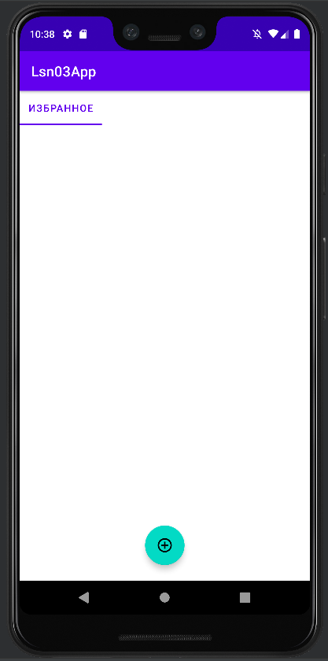
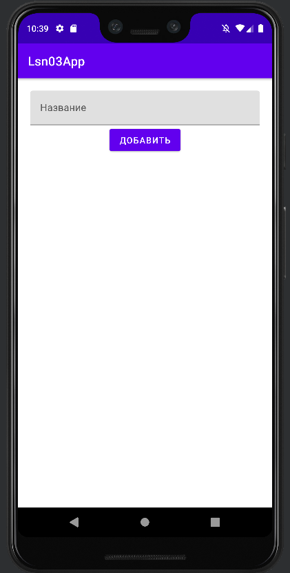
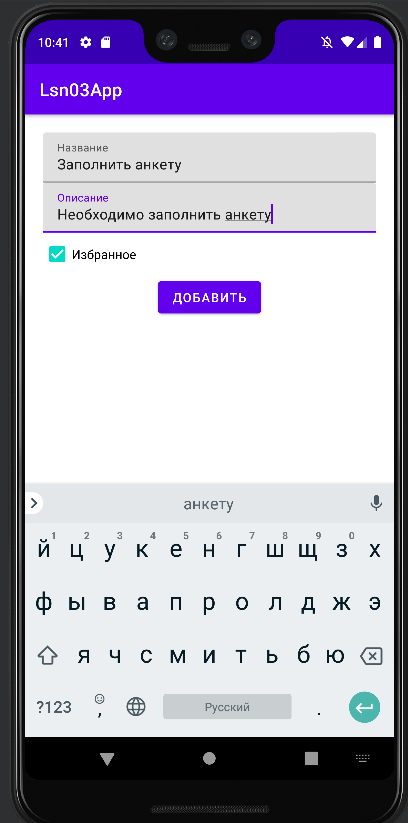
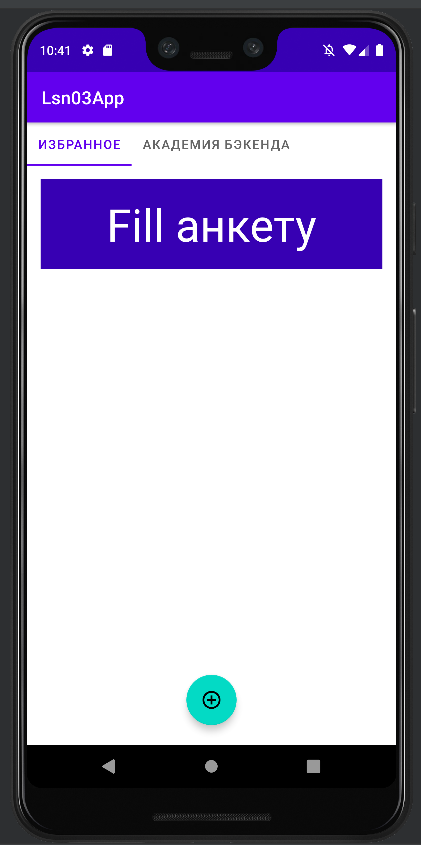
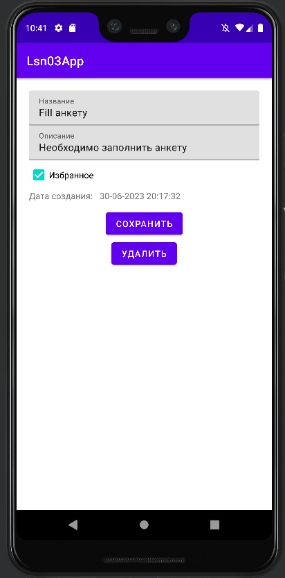
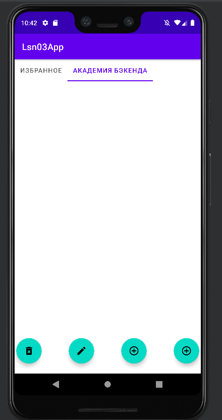
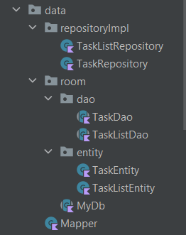
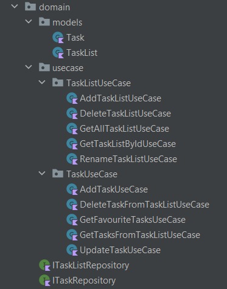
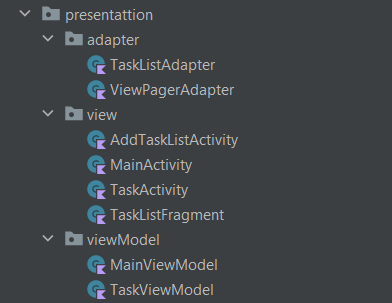

# Оглавление
1. [Описание проекта](#описание-проекта)
2. [Архитектурный паттерн MVVM](#архитектурный-паттерн-mvvm)
   - [Модель (Model)](#модель-model)
   - [Представление (View)](#представление-view)
   - [Модель представления (ViewModel)](#модель-представления-viewmodel)
3. [Принципы Clean Architecture](#принципы-clean-architecture)
   - [Data слой](#data-слой)
   - [Domain слой](#domain-слой)
   - [Presentation слой](#presentation-слой)

## Описание проекта
Приложение представляет собой ToDo лист, который позволяет добавлять задачи, создавать списки, отмечать их как избранные и удалять как списки, так и отдельные задачи.
 
Реализован CRUD интерфейс для задач и списка задач.
 
1. Просмотр избранного таск листа   
2. Добавление таск листа  
3. Добавление задачи  
4. Отображение в избранном  
5. Редактирование задачи  
6. Удаление задачи  

## Архитектурный паттерн MVVM
MVVM (Model-View-ViewModel) - это архитектурный паттерн, который помогает разделить приложение на три основных компонента: модель (Model), представление (View) и модель представления (ViewModel). Вот краткое описание каждого компонента:

### Модель (Model)
Отвечает за представление данных и бизнес-логику приложения. В этом случае моделью является Domain слой.

### Представление (View)
Отображает данные пользователю и обрабатывает пользовательский ввод. В этом случае представлением являются Activity, которые отображают данные и являются пользовательским интерфейсом.

### Модель представления (ViewModel)
Связующее звено между представлением и моделью. ViewModel получает данные из модели и предоставляет их для отображения в представлении. Он также обрабатывает пользовательский ввод и взаимодействует с моделью для выполнения соответствующих действий. В этом случае ViewModel реализованы в Presentation слое.

## Принципы Clean Architecture
Clean Architecture - это подход к проектированию программного обеспечения, который способствует высокой степени разделения между различными уровнями приложения и обеспечивает независимость каждого уровня. В этом проекте были соблюдены принципы Clean Architecture. Вот краткое описание каждого слоя:

### Data слой
Data слой отвечает за реализацию интерфейсов и работу с базой данных. В этом случае используется библиотека Room, которая является оберткой над базой данных SQLite. Room позволяет легко работать с базой данных в этом приложении и предоставляет удобные средства для выполнения операций CRUD (создание, чтение, обновление и удаление) над данными. 

### Domain слой
Domain слой содержит модели приложения и бизнес-логику. Здесь были созданы UseCase, которые определяют, какие операции можно выполнять в приложении. UseCase представляет собой интерфейсы, которые затем реализуются в Data слое. Domain слой служит как связующее звено между Presentation и Data слоями, обеспечивая разделение ответственности и независимость между ними.  

### Presentation слой
Presentation слой содержит ViewModel, которые используют UseCase, а также Activity, которые отображают данные и являются пользовательским интерфейсом. ViewModel получают данные из Domain слоя и предоставляют их для отображения в Activity. Они также обрабатывают пользовательский ввод и взаимодействуют с Domain слоем для выполнения соответствующих действий. 

